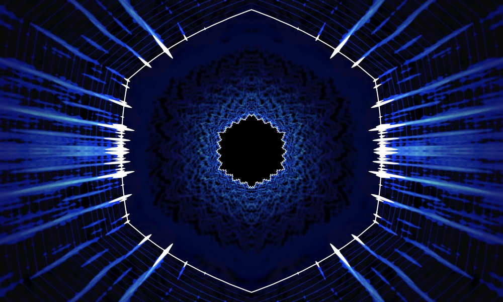

# **raVe** (real-time audio visualizer experience)



## What is raVe?

**raVe** stands for **real-time audio visualizer experience**.

Most music visualizers available right now, such as the ones found in iTunes and Windows Media Player, don't offer true "music visualization," but rather "music synched visuals." They typically have a predetermined animation, where different aspects of it will change when a beat is detected in the song.

**raVe** isn't an animation that reacts to the beat, but rather a true visualization of the audio data itself. The frequencies and waveforms of the incoming audio are used to generate **raVe**'s rings, and the previous frames expand out from the center to display the history of the audio.

Because **raVe** uses all of the audio data available to it for visualization, every song is visually unique. The same goes for the vocals; singers' voices are visually distinct as they contain different harmonics and waveform types. Unique sounds in songs look amazing, and in my opinion, the best songs to watch on **raVe** are chill songs with not too much going on.

## Technical Details

**raVe** uses the **Web Audio API** and **Canvas API** to collect and draw the audio data in real-time.

With **Web Audio API**, you can create different types of nodes to route audio through, including **AnalyserNode** and **BiquadFilterNode**. These two nodes are the key pieces to making **raVe** work.

**AnalyserNode** is a wonderful little piece of **Web Audio API** that allows you to sample frequency and time domain data from the audio source. Frequency data gives the amplitudes of frequency bins starting at 0&nbsp;Hz up to about 22&nbsp;KHz, with a bin width of about 22&nbsp;Hz. Time domain data is the waveform of the audio, or how the speaker film would vibrate to output the audio.

**BiquadFilterNode** is a node that you can connect audio through to apply different biquad filters, such as highpass or lowpass. These filters allow **raVe** to filter out different frequencies to make the visuals more aesthetic. For example, the entire audio source is run through a lowpass filter of 5&nbsp;KHz, so that snares and "sss" noises don't brighten **raVe** too much.

## Anatomy of **raVe**

**raVe** generates 2 rings from the audio data, and both rings slowly morph between a circle and hexagon.

The inner ring is the audio waveform applied to the ring's shape, and mirrored along the y-axis.

The outer ring is made up of both frequency and time domain data, and is symmetric over both the x and y axes. The frequency data goes from 0&nbsp;Hz at the horizon to about 7&nbsp;KHz at the top and bottom. The time domain data used for the outer ring is filtered to only show bass frequencies.

## Running **raVe** locally

```bash
yarn install
yarn serve
```
